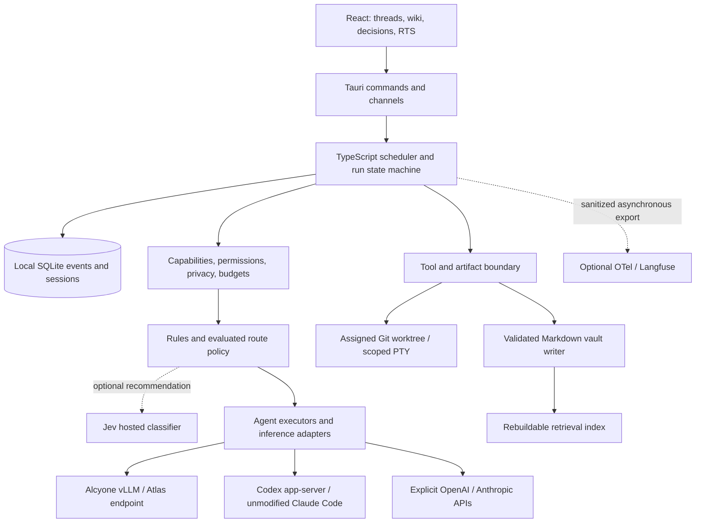

# Skippy_space: desktop workspace and hybrid harness

| Field | Value |
|---|---|
| Version | 0.2, implementation proposal, 2026-09-25 |
| Owner | JusHoya |
| Target | Windows desktop; personal account sessions with organization decision records |
| Implementation audience | Claude Opus, working in bounded, verified increments |
| Baseline | `7b17b70`; branch `assessment/desktop-harness-prd-2026-09-25` |
| Supporting documents | [Assessment](ASSESSMENT-2026-09-25.md), [research](research/08-revival-research-2026-09-25.md), [model plan](MODEL-AND-CLUSTER-PLAN.md), [handoff](CLAUDE-OPUS-HANDOFF.md), [quantization](research/09-quantization-2026-09-26.md), [cloud cost](research/10-cloud-orchestration-cost-2026-09-26.md), [subscription lanes](research/11-subscription-orchestration-2026-09-26.md) |

## 0. Authority and scope

This version is the source of truth for the requested revival. The original is preserved verbatim in [PRD v0.1](archive/PRD-v0.1-2026-04-29.md). It retains historical design detail; where versions conflict, v0.2 wins. Old research and phase labels describe history, not verified completion. Requirements below are proposed behavior, not claims that the baseline implements them.

The user's direction is settled: a Codex-style workspace with RTS and Obsidian integration; model selection by quality, complexity and cost; balanced local/cloud use; the owner's Claude Max and OpenAI Pro accounts; coexistence with Pleiades/Money Printer; and Jev-assisted organizational decisions. This assessment branch delivers a specification, not a deployment or model download.

Changes from v0.1: conversation-first navigation replaces mandatory map-first layout; a provider-independent harness replaces fixed Claude model enums; local execution and supported personal subscription sessions become first-class routes; durable runs precede autonomy; Jev becomes an optional decision adviser; telemetry and Letta become optional integrations. Tauri, React, Pixi, TypeScript, Markdown, Skippy's persona and the eight boards remain.

Priority terms: **P0** prevents unsafe or false execution; **P1** is required for the hybrid beta; **P2** is a follow-on improvement. Requirement IDs are stable implementation references. Every enabled feature must pass its applicable milestone gates.

## 1. Product outcome

Skippy_space is the owner's daily workbench for assigning work, reviewing changes and building organizational knowledge. A user starts a persistent thread, sees task ownership and execution choices, inspects evidence and diffs, and resumes after interruption. The RTS view depicts those same tasks. The wiki records their sources and decisions.

Success means useful completed work per unit of time and cost, with truthful outcomes and controlled authority. Agent count, downloaded model count and token rate are supporting measurements.

| Core journey | Required outcome |
|---|---|
| Continue yesterday's change | Restore thread, worktree, artifacts and known run state without repeating side effects |
| Fix a small bug | Prefer an eligible local worker where justified; show owner, model, tests and reviewable diff |
| Request a difficult architectural change | Allow direct premium execution with explicit budget and existing permissions |
| Investigate a prior decision | Search wiki, follow sources/backlinks and open the exact note in Obsidian |
| Watch a multi-board mission | RTS and list views show the same states; sprite selection opens the task's thread |
| Assign review of an organizational proposal | Decision inbox shows evidence, optional Jev recommendation, owner and recorded outcome |
| Work while Alcyone is busy or Atlas is gaming | Queue or use an eligible alternative without evicting Hermes or sending local-only data to cloud |

Out of scope: multi-tenant hosting, pooled personal credentials, autonomous financial/trading approval, distributed GPU memory pooling, cluster reprovisioning, fine-tuning, a full IDE/Obsidian replacement, cloud vault sync and rebuilding Money Printer's statistical factory. Named reviewers do not establish a multi-user authentication service.

## 2. Desktop workspace

### 2.1 Information architecture

```text
+--------------------+-------------------------------------+--------------------+
| Project / workspace| Thread | Changes | Wiki | RTS        | Context inspector  |
| Search / new thread|-------------------------------------|--------------------|
| Threads            | Persistent conversation or artifact | Selected task      |
| Decisions          | Plan -> tasks -> tools -> results   | Evidence / sources |
| Wiki               | Linked code diff / note / decision  | Route / budget     |
|                    |                                     | Approvals / checks |
| Connections        | Composer + route preference         |                    |
| Cluster status     |-------------------------------------+--------------------|
|                    | Terminal | Events | Problems (collapsible dock)           |
+--------------------+----------------------------------------------------------+
```

**FR-UI-01 (P1):** Provide a persistent project/thread rail, central workspace, optional inspector and resizable bottom dock. Thread is the default. State is keyed by workspace. Empty states distinguish no project, no connection, unavailable provider and no results.

**FR-UI-02 (P1):** Display user intent, concise plans, tool activity, artifact links, validation and terminal outcome. Streaming events belong to a specific thread/run/attempt. Concurrent runs cannot replace each other's content. Persist drafts and selection/scroll state without credentials.

**FR-UI-03 (P1):** RTS, Changes and Wiki are peer tabs and may open beside the thread. Preserve eight captains and layered beercan sprites. A task has the same ID in every view. Show idle, queued, active, awaiting approval, paused, failed and completed distinctly. Animation cannot imply progress unsupported by events. Provide a list alternative when WebGL is unavailable.

**FR-UI-04 (P1):** Changes shows the assigned worktree's actual diff, files, tests and review status. Terminal tabs identify working directory and owner. Changing global project selection cannot silently change a running task's checkout. Applying/merging changes is explicit and respects existing authorization.

**FR-UI-05 (P1):** Composer policies: Balanced (default), Local only and Best available, plus an explicit model/executor pin. Show route, host, billing lane and short reason. A pin persists at its selected scope; an unavailable pin queues or requires a changed choice rather than silently substituting. Separate estimated, reported and unknown costs.

**FR-UI-06 (P1):** Search/command palette reaches threads, tasks, notes and decisions. Normal Tab navigation remains available. RTS shortcuts act only in a focused map, never editor/terminal input. Meet WCAG 2.2 AA contrast/focus expectations; support keyboard journeys, 200% zoom, reduced motion and non-color status cues. Narrow layouts use drawers rather than unreadable squeezed panes.

**FR-UI-07 (P2):** Use restrained dark/light tokens, readable typography and subtle board accents. Keep Skippy's voice in authored content; controls/errors/financial figures stay precise. Preserve transient scene data outside Zustand. Check 1280x720 and 1920x1080, with inspector and dock expanded/collapsed.

Acceptance: restart a two-thread session; recover content; select one task via sprite/list/thread; inspect its exact diff/source; complete the journey by keyboard; exercise no-WebGL/reduced-motion modes. Fixtures are visibly labelled and cannot emit real-success records.

## 3. Architecture and boundaries



**FR-ARCH-01 (P1):** Keep one desktop-owned control plane initially. Tauri owns platform boundaries; Node owns orchestration; React consumes public state. Remote inference receives scoped input and returns text/tool proposals. It does not require repository write access or remote shell authority.

**FR-ARCH-02 (P1):** Separate `InferenceAdapter` (messages/typed output/capabilities/usage) from `AgentExecutor` (start/attach/interrupt/events/approvals/outcome). Provide distinct local, provider API, Codex app-server and Claude Code adapters. Retain native session IDs. An OpenAI-compatible endpoint is not interchangeable with an agent runtime; subscription login is not an API key.

**FR-ARCH-03 (P1):** Version shared protocol schemas across TS/Rust. Use validated string model identifiers and capabilities, not a closed three-model enum. Unsupported protocol versions fail visibly. Additive unknown fields do not crash old renderers. Generate or contract-test mirrored DTOs.

**FR-ARCH-04 (P1):** Core work operates without Langfuse, Letta, Obsidian REST or Jev. Filesystem vault, local events and lexical retrieval provide the baseline. Optional-service degradation is visible and cannot fabricate successful results.

### 3.1 Persisted domain records

| Record | Minimum fields |
|---|---|
| Workspace | ID, canonical repo/vault paths, policy ID, local state location, allowed roots |
| Thread | ID, workspace, title, messages/artifacts, timestamps |
| Task | ID, thread, board, dependencies, intent, acceptance criteria, risk/data class, worktree, state |
| Run | ID, task, initial policy snapshot, budget reservation, timestamps, outcome |
| Attempt | ID, run, sequence, executor/provider/model/revision, host, native handle, context manifest, reason, state |
| Event | Unique ID, per-run monotonic sequence, schema version, UTC time, type, actor, payload/artifact references |
| Tool action | ID/idempotency key, attempt, validated args or redacted hash, authority/approval reference, status/result |
| Usage | Attempt/request ID, billing lane, token categories, duration, cost basis, currency/rate version |
| Decision | ID, question/options version, evidence hashes/references, rules, prediction, owner, disposition/outcome |
| Deployment | Artifact revision, endpoint alias, capabilities, context/output caps, health time, resource/quality qualification |

Store secrets outside these records. Sensitive prompts/tool outputs follow retention and redaction policy. Keep SQLite on a verified local filesystem outside vault Git history, normally per-user application data. Resolve mapped-drive storage before choosing a database location. Back up consistently through a database snapshot, not by copying a live WAL file.

## 4. Truthful, durable execution

**FR-RUN-01 (P0):** Acknowledgement means accepted, never completed. Success requires a terminal executor result and the task's validation disposition. Distinguish succeeded, failed, cancelled, interrupted, blocked and simulated. Missing keys, disabled execution and provider failures cannot fall back into success. Demo mode has separate records.

**FR-RUN-02 (P1):** Persist state/events before acknowledging transitions. Active path: `queued -> running -> awaiting_approval/pausing/validating -> terminal`. `paused` requires an acknowledged safe boundary. Resume attaches or creates an attempt. Failed dependencies block dependents unless their declared policy permits partial inputs.

**FR-RUN-03 (P1):** Serialize writes within a thread/worktree; allow independent worktrees concurrently. One writable worktree has one active task owner. Record base commit, branch/path, changes and checks. Never reset/clean a dirty user checkout as recovery. Manual edits require reconciliation.

**FR-RUN-04 (P1):** Checkpoint at tool boundaries: intent, accepted plan, constraints, evidence, base/diff hashes, completed action IDs, outstanding approvals and validation. Provider switches start new attempts from bounded handoffs. Native hidden state, private reasoning and KV caches do not transfer. Do not switch mid-stream or replay tools to reconstruct context.

**FR-RUN-05 (P1):** Cancellation reaches model streams, pending tools and process trees. UI shows requested then acknowledged/unsupported/timeout. No new tool starts after accepted cancellation. Late output cannot overwrite the outcome; late usage is still recorded. An uncertain external side effect awaits reconciliation, not automatic retry.

**FR-RUN-06 (P1):** One shutdown coordinator stops admission, persists events/checkpoints, interrupts children and closes resources under a deadline. On restart, active records become interrupted or reattach after native verification. Bounded retries retain prior artifacts and costs.

**FR-RUN-07 (P1):** Replay reconstructs UI without execution. Resume executes from a checkpoint. Git restore changes files explicitly. Idempotency and reconciliation reduce duplicate actions; do not claim exactly-once external side effects.

Acceptance: SDK disabled/exception and failed validation produce nonsuccess; two streams never cross threads; kill runtime before/after file actions and recover without duplicate writes; reject late tools after cancel; replay invokes zero tools.

## 5. Routing, accounts and economics

### 5.1 Supported lanes

**FR-PROV-01 (P1):** Use installed Codex app-server with managed login, version handshake, model discovery, threads/turns, approvals and rate-limit reporting. The owner authenticates through OpenAI. Official client owns tokens; Skippy stores safe references. Discover actual eligibility rather than inferring it from a plan name. See [research](research/08-revival-research-2026-09-25.md).

**FR-PROV-02 (P1):** Max integration launches installed, unmodified Claude Code in a scoped worktree with its own login options and permission UX. Qualify its supported structured interface at implementation time. A PTY fallback is an attached manual session, not machine-verified completion derived from prose. Do not add a Claude.ai login, extract tokens or pool a personal account across users.

**FR-PROV-03 (P1):** Anthropic SDK/API and OpenAI API lanes require explicit credentials and separate budgets. Subscription access does not make API calls free. Quota exhaustion cannot silently trigger paid API fallback. Multi-user automation requires separately configured appropriate service credentials.

**FR-PROV-04 (P1):** Test local capabilities per model/server revision: chat, streaming, tool parsing, structured output, cancellation, usage and context rejection. Enable tools only when qualified. Weights and `/models` listings alone are insufficient. Catalog entries have freshness/identity checks.

### 5.2 Route policy

**FR-ROUTE-01 (P1):** Balanced is default. Hard filters precede scoring: data egress, tools/executor authority, context/modalities, health, capacity, pin and spend/quota. Local only applies to generation, embeddings, Jev, telemetry and fallbacks. No eligible route means queued/blocked with reason, not policy downgrade.

**FR-ROUTE-02 (P1):** Rank eligible candidates using measured task-family success, complexity/risk, queue/latency and incremental cost. Begin with inspectable rules. Features include action type, dependencies, affected surface, testability, input size and prior failures. Jev can advise on ambiguity but cannot restore excluded candidates or authorize tools.

**FR-ROUTE-03 (P1):** Permit direct premium routing for difficult/high-risk work. Prefer qualified local capacity for suitable bounded tasks. Initial automatic limits: one retry and one route escalation per task, both budgeted. Exceeding limits blocks for review rather than cycling indefinitely.

**FR-ROUTE-04 (P1):** Freeze executor/model within an attempt. Re-evaluate at safe checkpoints on failure, context pressure or scope change. Record policy/model versions, excluded candidates and public reasons. Do not expose private chain-of-thought as a route explanation.

**FR-ROUTE-05 (P2):** Learn from outcomes/overrides only with a versioned labelled dataset and held-out time/task-family split. Self-reported confidence is not validation. Model updates invalidate affected qualification until retested.

### 5.3 Cost and quota contract

**FR-COST-01 (P1):** Meter requests/attempts including retries, available input/output/cache categories, tool charges and Jev. Preserve usage source and rate date. Mark reported, estimated and unknown values. Unknown model prices stay null, never a guessed fallback. Historical calculations retain their rate version.

**FR-COST-02 (P1):** Separate API spend, subscription allowance, optional allocated subscription expense and local resource estimates. Do not convert subscription tokens into an actual API invoice. Some clients expose no trustworthy dollars; show that limitation.

**FR-COST-03 (P1):** Reserve a conservative attempt maximum against task/day budgets before concurrent dispatch; reconcile later. Deny new paid work without a valid bound/budget. New API/Jev budgets default to zero until configured. Eligible personal sessions remain available within provider limits. Enforce output/time/step caps, backoff and circuit breakers. Record unavoidable post-interruption billing honestly.

Acceptance: fake providers cover quota exhaustion, stale prices, unknown usage, simultaneous reservations, cached tokens and differently priced attempts. Paid fallback needs a configured budget. Local-only generates zero cloud/Jev/export requests. Pins never silently change.

## 6. Skippy, boards and tool authority

### 6.1 Charter compatibility

Skippy plans, delegates, monitors and synthesizes; task agents implement. Retain Engineering, Coding, Design, Marketing, Finance, Research, Publishing and DevOps. Identity/costume are independent of executing model. Eight logical boards do not imply eight resident LLMs.

**FR-BOARD-01 (P1):** Validate existing charter fields: identity/costume, model/effort, permission mode, MCP servers, tools/disallowed tools, memory, spawnable agents and upstream provenance. Preserve legacy model preferences during migration; unsupported IDs surface a migration choice. Add a versioned execution profile for route, tool scope and budget. Never silently broaden authority.

Execution profile sketch (routes name deployment aliases, never raw model IDs, so swapping weights or tiers does not edit charters):

```yaml
execution_profile:
  version: 1
  orchestrate: cloud.orchestrator          # Skippy + captains; see D-01
  implement: local.atlas.coder             # Coding/Engineering task agents
  escalate: [cloud.claude.coder, cloud.codex.top]
  review_high_risk: cloud.claude.opus
  budget_ref: board-default
```

**FR-BOARD-02 (P1):** Ownership is Skippy -> Board -> Task. Use separately supervised executions where native SDK nesting cannot represent this graph. No task creates grandchildren. Native subagents remain within authorized graph/budget. Charter changes require a proposed Hoya_Box upstream change, not an unrequested write there.

### 6.2 Execution authority

**FR-SEC-01 (P0):** Remove unconditional permission bypass. Custom-loop tools use a broker validating arguments, roots, network destinations, action class and authorization. Native executors enforce equivalent constraints with native sandbox/approval controls and working directory. Observing tool events is not enforcement; an incapable adapter is ineligible.

**FR-SEC-02 (P0):** Validate Windows absolute/drive-relative/UNC paths, traversal, case normalization, symlinks/junctions and real ancestors for new paths. Recheck containment at write time. Reject reparse paths that cannot be safely contained. Use structured process arguments instead of shell interpolation. Credentials belong in OS or provider-managed stores, never renderer state or vault notes.

**FR-SEC-03 (P1):** Retrieved/repository/external text is evidence, not authority to expand tools/network. High-impact external actions require existing matching authorization or a concrete approval record. Respect persistent authorization rather than asking repeatedly. Bind approvals to action/arguments/workspace hashes; material changes invalidate them.

**FR-SEC-04 (P1):** Redact secrets from logs/events/exports. Scope MCP servers per task/charter, validate untrusted output and do not connect arbitrary servers named in content. Failures are structured and actionable.

Acceptance: denied tool, changed approval, path escape/junction, injected authority and log-redaction tests. Each native executor proves that a denied write actually fails before qualification.

## 7. Pleiades and local models

**FR-CLUSTER-01 (P1):** Adopt the [model plan](MODEL-AND-CLUSTER-PLAN.md). Inventory live state before connecting; label historical observations. Preserve existing `mp-vllm`/Hermes settings. Access loopback Alcyone through an authenticated localhost-only tunnel. Model/endpoint drift makes qualification stale.

**FR-CLUSTER-02 (P1):** Separate acquisition, loading, health and qualification. Pin revision, quantizer, checksum, license, runtime/image and tested settings. Downloading/loading candidates never implicitly replaces production. Failed downloads/full disk leave the qualified service usable.

**FR-CLUSTER-03 (P1):** Per D-02, Hermes and Skippy share one consolidated Alcyone server that must honor Hermes' 65,536 context and 8,192 output cap. Start at one admitted Skippy request; preserve Hermes limits until verified. Four configured sequences are not four spare slots. Larger processes use separate ports and measured resource budgets. Strict Hermes priority needs coordination of its independent requests, not only a Skippy semaphore.

**FR-CLUSTER-04 (P1):** Atlas is opt-in, with idle/gaming controls, tested memory/context and no always-on assumption. Retrieval batches yield to interactive work. Remote inference does not imply shared files or remote tools. Unavailable Atlas follows normal route policy.

**FR-CLUSTER-05 (P1):** Preserve Money Printer CPU/memory isolation, networkless factory, sealed data, statistical gates and owner approvals. Allowlist operational reports/status fields. Never recursively index its data, credentials, Git history or holdouts. Maia remains the sandbox; other devices retain existing responsibilities.

**FR-CLUSTER-06 (P2):** Show host/model/freshness/qualification/queue/resource status. Use side-effect-free health probes; Money Printer's `/healthz` is preferable to its recorded CSV-writing `/api/status`. Reuse documented plugin/report interfaces; do not invent a Hermes control API.

Acceptance: tunnel loss/sleep produces truthful state; local-only waits instead of going cloud; ID drift disables unqualified tools; mixed-load gates pass without altering Money Printer or accessing sealed data.

## 8. Obsidian wiki and memory

### 8.1 Ownership

**FR-WIKI-01 (P1):** Markdown/attachments are the knowledge source of truth. Provide tree/search/backlinks/source preview/decision links and Open in Obsidian. Resolve links safely. UI/MCP/jobs/optional REST share one logical write service. External Obsidian edits require conflict detection independent of its cooperation with our locks.

### 8.2 Writes and ingestion

**FR-WIKI-02 (P0):** Validate containment/frontmatter, lock full read-modify-write, compare expected content hash before atomic replace. Preserve ID, creation time, unknown metadata and authored text. External changes produce a conflict/rebase flow. Agent logs/daily notes use dedicated append-only operations; general overwrite cannot bypass this.

**FR-WIKI-03 (P0):** Preserve imported originals by content hash. Declare text encodings; PDF/binary extraction needs qualified extractors. Unsupported formats stay intact with errors. Derived text includes original reference, extractor version and offsets/pages where available. Crashes cannot remove the only source copy. Ingest is resumable/deduplicated.

**FR-WIKI-04 (P1):** Distillation produces drafts with provenance/evidence. Provider failure cannot become successful mock extraction. Canonical promotion requires review or an explicit evaluated low-risk policy. Link contradictions instead of overwriting. Default factual retrieval uses reviewed evidence; drafts require visible inclusion labels.

### 8.3 Frontmatter compatibility

Retain `id`, `title`, `created_at`, `updated_at`, `type`, `status`, `tags`, `source`, `authored_by`, `confidence`, `distilled_from`, `supersedes`, `contradicts`. Keep types `atomic_fact`, `decision`, `postmortem`, `snippet`, `external_source`, `conversation_summary`, `agent_log`, `daily`, `weekly`, `project_brief`, `entity`, `concept`, `agent_persona`; statuses `draft`, `active`, `distilled`, `canonical`, `archived`, `deprecated`.

Add optional versioned source hash, extractor/generator, evidence spans, review provenance and decision ID. Legacy confidence is metadata, not calibrated truth. Nondraft atomic facts require a source; existence of a source alone does not prove a claim. Migrations preserve unknown keys and remain reversible from backup.

### 8.4 Retrieval and history

**FR-WIKI-05 (P1):** Lexical search plus an owned rebuildable vector index. Namespace by model revision, dimensions, normalization, query template and chunker; reject mixed spaces even at equal dimensions. Reindex by hash. Lexical fallback works offline. Reranking is optional/bounded; results include evidence IDs/spans.

**FR-WIKI-06 (P1):** Git history is separate from checkpoints. Autocommit includes only intended vault changes, preserving unrelated staged work. Handle locks/conflicts/failure explicitly. Never auto-push, sync secrets or bypass data exclusions via Git history. Obsidian remains an optional installed application.

Acceptance: detect external edit conflicts; reject escaping paths; retain binary originals and ULIDs; protect append-only notes; reject incompatible vectors; prove unrelated staged files are absent from a vault autocommit.

## 9. Jev and organizational decisions

**FR-JEV-01 (P1):** Optional TypeSafe adapter with pinned model, validated I/O, timeout/cancel/backoff and usage. Start with `jev-1.13.0` if still available. It is hosted typed prediction, not a code executor or verified downloadable model. Input is billable; see [research](research/08-revival-research-2026-09-25.md).

**FR-JEV-02 (P1):** Rules first. Send minimal permitted evidence with explicit instructions/options and insufficient-evidence choice. Exclude local-only tasks, secrets and sealed data. Compute arithmetic, dates, budgets and permissions in code. Reject malformed/nonfinite probabilities and unknown choices.

**FR-JEV-03 (P1):** Initial uses: board assignment, review priority, evidence completeness, possible wiki duplication/contradiction. Outputs are recommendations. Financial/capital decisions, security exceptions, deployments and Money Printer promotions retain their owner/deterministic gates. Confidence cannot waive them.

**FR-JEV-04 (P1):** Persist question/options version, evidence snapshot/hash, constraints, prediction/distribution, model, confidence when available, recommendation, owner, override and eventual outcome. Export a linked `decision` note. Separate proposed/awaiting owner/accepted/rejected/superseded states. Predictions and decisions are different immutable events.

**FR-JEV-05 (P1):** Shadow mode by default: rules govern behavior while predictions are reviewed. Label at least 200 varied decisions before considering automatic low-risk classes; use held-out examples and review disagreements. Measure coverage, selective error, Brier/calibration, latency, overrides and incremental cost against rules and a local classifier. Sample count alone is not proof.

**FR-JEV-06 (P2):** Promote a narrow low-risk class only when held-out selective error's 95% upper confidence bound is at most 2%, with zero hard-policy violations, useful coverage and net benefit. Otherwise abstain. This is a target, not measured Jev accuracy. Thresholds are version/domain-specific. Model/question changes return to shadow until retested.

**FR-JEV-07 (P1):** Outages, 429s, malformed output and disabled budgets retain deterministic routing and owner inbox. Judgment-dependent decisions wait for review. Log fallback; never invent confidence or approve automatically.

Acceptance: labelled fixtures exercise ambiguity, injected instructions, confidently wrong prediction, timeout, 429, invalid JSON and model drift. Hard constraints reject violations independently of predictions.

## 10. Observability and release operations

**FR-OPS-01 (P1):** Local ledger powers status/replay/diagnostics. OTel export is async, redacted and bounded; outages cannot fail tasks or exhaust storage. Correlate run/attempt/tool/artifact IDs. Log public outcomes and route facts, not hidden reasoning.

**FR-OPS-02 (P1):** Fix the incompatible telemetry stack with a pinned, supported authenticated configuration and tested backup/migration. Bind locally. Letta is a derived optional service. Moving observability to Spark requires resource assessment.

**FR-OPS-03 (P1):** Windows CI covers Rust/build and desktop boundaries. Run meaningful TS tests and explicit lint scripts. Browser tests cover navigation/accessibility; native tests cover PTY/sidecar/files/cancel. Label mocked tests versus live opt-in qualification.

**FR-OPS-04 (P1):** Validate installation outside the checkout and from another current directory. Keep the existing Node prerequisite policy; explicitly supply external sidecar dependencies. Resolve application resources separately from user projects. Keep updater/signing disabled until configured/tested.

**FR-OPS-05 (P1):** Migrations back up/check compatibility and fail without data loss. Import legacy events read-only or retain a viewer; legacy simulated/ambiguous results never become verified success. Use explicit feature rollout flags and reversible desktop/config rollback.

## 11. Evaluation and release gates

These numbers are targets. No application/hardware benchmark was run during assessment.

| Gate | Evidence required |
|---|---|
| G0: truth/authority | Zero false success for failed/disabled/simulated work; denied tools/paths; original retention; staged-user-work preservation |
| G1: recovery | Crash/cancel/restart at tool boundaries; no cross-thread events or duplicate writes; replay executes no tools |
| G2: providers | Each lane proves auth, discovery, policy, structured outcomes, cancellation, quota/unavailable paths and billing classification |
| G3: local | Model-plan 60-task suite, memory/context results and mixed-load tests; no OOM/policy violations; Hermes/factory within agreed performance budget |
| G4: routing quality | Held-out accepted-task quality at least 95% of best-available baseline; no critical security/data-loss regression; publish time/cost tradeoff |
| G5: economics | Target 30% lower metered API spend on the same mix where an API baseline exists; separately report subscriptions/local resources. Prefer quality if targets conflict; keep route experimental |
| G6: knowledge | Retention, ID, conflict/append-only and vector-compatibility tests; at least 30 labelled wiki questions with source correctness and recall@k |
| G7: decisions | Jev shadow/holdout/fallback evidence and zero policy overrides; no promotion from sample count alone |
| G8: desktop | Keyboard/no-WebGL/reduced-motion checks, Windows native integration and clean-install smoke test with versions |

Use representative Skippy tasks, approved Pleiades docs and synthetic fixtures. Exclude Money Printer holdouts/credentials and unclassified private records. Freeze tasks/configuration before comparison. Publish model/revision, prompts/tools, environment, resources, failures and review rubric. Do not cherry-pick successes.

## 12. Delivery sequence

| Milestone | Scope | Exit | Dependency |
|---|---|---|---|
| M0: reliable foundation | Assessment A01-A05; explicit demo; baseline/tests | G0; unrun checks recorded | None |
| M1: durable work | Protocol/state/worktrees/shutdown/cancel; thin thread shell | G1; two-thread vertical slice | M0 |
| M2: executors | Codex/Claude personal lanes; explicit API lane; native enforcement | G2 per enabled lane | M1 |
| M3: balanced local | Existing Alcyone, Atlas qualification, router/budget/catalog | G3-G5 or explicit experimental status | M1-M2; probes may start after M0 |
| M4: knowledge/decisions | Wiki UX/index; decision inbox; Jev shadow | G6-G7; works with Jev off | M1; wiki safety already M0 |
| M5: desktop beta | RTS projection, review polish, accessibility, packaging/telemetry | G8 and previous gates | M1-M4 |

Deliver vertical slices, not a simultaneous rewrite. UI fixtures remain labelled until backed by real events. No calendar promise is justified before the build baseline. [Handoff](CLAUDE-OPUS-HANDOFF.md) provides tickets and file entry points.

## 13. Risks

| Risk | Mitigation |
|---|---|
| Native clients/account terms change | Pin/qualify supported interfaces; explicit API/manual alternatives |
| Local models fail tools/schema tasks | Capability gates, scoped tasks, real validation, eligible escalation |
| Large model disrupts existing work | Acquisition/loading separation, conservative admission, mixed-load rollback |
| Jev certain on weak evidence | Rules, scoped evidence, abstention, evaluation and owner accountability |
| Wiki corruption or invented knowledge | Containment, originals, conflict detection, review and citations |
| Revival becomes infrastructure rewrite | Reuse stack; local state first; short model list; defer hosting/fine-tuning |
| Subscription usage obscures cost | Separate quota/allocation/API expense; no silent paid fallback |
| Stale sibling docs mislead deployment | Dated provenance and live inventory before changes |

## 14. Open questions and defaults

| ID | Unknown | Nonblocking default |
|---|---|---|
| OQ-01 | Current Alcyone model/image/load/capacity | Treat September records as historical; inventory before routing |
| OQ-02 | Actual account entitlements/client versions/quota | Official login/discovery; unavailable lane disabled |
| OQ-03 | Paid API/Jev task/day/month budget | Zero new metered budget until configured; eligible personal/local lanes available |
| OQ-04 | Organizational data egress/retention rules | Local-only for unclassified confidential records; synthetic/redacted Jev fixtures |
| OQ-05 | Atlas runtime/idle hours and backing storage | Opt-in worker; qualify Windows runtime and local DB placement |
| OQ-06 | Organizational ratifiers | Owner remains final authority; named reviewer is not multi-user auth |
| OQ-07 | Accepted quality/cost tradeoff | Provisional section 11 targets; failing routes remain experimental |
| OQ-08 | Cheapest cloud tier that sustains orchestration | Run on the owner's current plan with per-turn metering (D-01); compare against lower subscription tiers and a capped API budget |
| OQ-09 | Consolidated Alcyone model and quantization | Qualify per the [model plan](MODEL-AND-CLUSTER-PLAN.md); 35B-class interim if no larger candidate passes Hermes' 65,536-context/tool suite |
| OQ-10 | Subscription login for orchestration | Per D-05: Codex app-server (managed ChatGPT login) and the unmodified `claude` binary, human-paced and event-driven; Agent SDK library use, background automation and evaluations use API keys with auto-reload and a hard monthly cap. See [research 11](research/11-subscription-orchestration-2026-09-26.md) |
| OQ-11 | Ceiling for "ordinary use" of subscription lanes | At most ~1 subscription orchestrator turn per minute, only while the owner is active; back off at 70%/85% of a 5-hour window |
| OQ-12 | Specialist model portfolio and residency | One resident LLM per machine; specialists load on demand through a multiplexer and unload when idle. See the [model plan](MODEL-AND-CLUSTER-PLAN.md) |
| OQ-13 | Validation disposition before tasks carry acceptance criteria (FR-RUN-01) | Until M1 adds criteria, a live executor's terminal success records `validation: not_defined` and may be `succeeded`; `failed` validation always forces nonsuccess. Demo (`SKIPPY_DEMO_MODE=1`) records are `simulated`, disabled/missing-key runs are `blocked`, and legacy `result: success` reads as `unverified` |
| OQ-14 | Approval channel for `ask` charters (FR-SEC-01, FR-SEC-03) | Until FR-SEC-03 approval records exist, approval-required actions (write, exec, network outside allowlist, core-memory edits) are denied by the default approver; SDK boards can read, search and append to memory only |
| OQ-15 | Is Obsidian Local REST ever a vault write path? (FR-WIKI-01/02) | No: REST is read/search only; all vault writes go through the local VaultBroker (lock, hash CAS, containment, append-only rules) |
| OQ-16 | Reserved append-only paths and ingest limits (FR-WIKI-02/03) | Every `.md` under `40_Daily/` is reserved for `type: daily` and `50_Agents/<board>/agent_log.md` for `agent_log`; ingest rejects files over 64 MiB; rejection records for unsafe names go to `00_Inbox/_ingest-errors/` |
| OQ-17 | Content-level secret exposure to boards (FR-SEC-02) | Credential paths are denied by name; a secret inside an ordinarily named file in an assigned worktree remains readable. Revisit with T10 executors (e.g. negative globs or content redaction) |
| OQ-18 | Grep/Glob credential containment is a tree gate, not output filtering (FR-SEC-01/02) | Before a Grep/Glob runs, the exact tree rg will walk (Grep: the interpreted `path` or the session cwd; Glob: the search directory the CLI derives from the raw pattern — `cliGlobSplit`, mirroring CLI 2.1.162, `dirname` when the pattern has no metacharacter — as a real long path; re-verify on every SDK/CLI bump) is enumerated in full — long names, reparse points not descended, no `node_modules`/VCS carve-out — up to 25,000 entries / depth 40. If any well-known credential entry (the `tool-policy.ts` deny list, now literally `.env*` and the vault's `.skippy/ingest-sidecar.key`) exists anywhere in that tree, or the bound is hit, the call is denied with "narrow `path` to a subtree without credential files"; the denial reports a count, never the paths. No input is rewritten and no glob is modelled (a glob can only narrow rg's output). A PostToolUse hook is defense in depth for the gate-to-rg race: it judges every path-separator-bounded substring of every output line and every listed path (literal and real) with no caps and withholds the entire output, also when the output is oversized or malformed. Cost, accepted: a search from a root whose tree holds any credential-named file (e.g. `.env.example`) or more entries than the bound (a pnpm `node_modules`) is denied until narrowed. Revisit the bound and a per-root allowlist of documented non-secret names with T10 executors |
| OQ-19 | Vault autocommit secret-scan limits and ingest provenance (FR-WIKI-03/06) | Fail closed, no proof step: autocommit never commits a path with any `filter` attribute (`filtered-path`: git-lfs or any clean filter) or any `working-tree-encoding` attribute (`encoded-path`: any value, even UTF-8, so a genuinely UTF-16 note under a legitimate rule is refused too; re-encoding stores ASCII secret bytes as text the scanner cannot judge and every checkout restores them, M0-G12), each evaluated against the pre-add and post-add index, nor any blob containing a git-lfs pointer version line, whatever its attributes (`lfs-pointer`, so `git push` can never upload an excluded secret through its pointer); all are reported as skipped. If `git add` dies on a file it cannot convert (a UTF-32 or BOM-less encoding, a failing required filter), those files are withheld as `encoded-path`/`filtered-path` and the rest of the tick proceeds (M0-G15). The other conversion attributes (`text`, `eol`, `crlf`, `ident`) only change line endings or the `$Id$` expansion and are scanned as git stores them. Every other candidate's exact staged blob is scanned, at most 64 MiB per blob (`limits.maxScanBytes`, shared by both engines; larger blobs are skipped as `too-large-to-scan`). If any attribute source (in-tree `.gitattributes`, `info/attributes`, global or system attributes file) changes during a tick, the whole tick is deferred (`attributes-changed`); only a flip and flip-back entirely between two observations can go unseen, which needs local write access to the repo. In a sparse checkout, out-of-cone paths are flagged, never a failed tick. Only the ingest pipeline may create `60_Sources/` notes or set provenance keys; reuse of an existing source note requires a byte-identical re-derived body |
| OQ-20 | Missing stop reason from OpenAI-compatible/local gateways (FR-RUN-01, FR-PROV-04) | Claude SDK executor: a success result without `end_turn`/`stop_sequence` is failed (truncated stream). Every main-thread turn is judged when it is superseded, not only at a `result`: a turn without a stop reason is complete only if every block it opened closed and the CLI ran one of its `tool_use` blocks without an `is_error` result (streamed or non-streamed turn, M0-G02/G03), or a non-streamed fallback for the same request completed it; any truncated turn fails the run. A superseded turn with a stop reason is normal for `end_turn`/`stop_sequence`, and for `tool_use` when the CLI returned a result for one of its tool calls (or it had none); `refusal` fails it `model_refused`; `max_tokens`, `pause_turn` and any other value fail it `executor_error` unless the CLI continued it inside the same segment (its max_tokens recovery). A main-thread `<synthetic>` message with a typed `error`, or a main-thread `StopFailure` hook, is a terminal failure even when no `result` follows (a background task keeps the segment open, M0-G01); an error `result` in the same segment already reports it. Retries the CLI recovers from emit only `system/api_retry` and are not failures. Truncation inside a task agent has no structured signal in CLI 2.1.162 and is not detected. Future local/compatible adapters must declare whether their endpoint reports stop reasons; one that cannot is ineligible for unattended success until qualified (T11/T13). |
| OQ-21 | Unicode normalization of vault paths on NTFS (FR-SEC-02, FR-WIKI-02/03) | Filesystem operations, locks, sidecar MAC locations and `_ingest-errors/` fallback keys use the exact on-disk names, never a case fold (NTFS's upcase table is not JavaScript's `toLowerCase`: it keeps U+212A KELVIN SIGN and `K`, `İ` and `i̇`, `ẞ` and `ß`, Georgian and Cherokee case pairs distinct). NFC/NFKC forms are used only for rule checks (reserved, hidden, lookalike, `.lock`). Creating a file or directory is refused (`normalization_collision`) when any existing sibling has the same conservative skeleton (`foldKey`: NFKC, then lower→upper→lower case mapping, then NFKD with combining marks and default-ignorable code points removed) but different bytes, and a segment that folds onto a reserved vault name it does not literally spell (`40_Daıly`) is rejected as `lookalike`. Accepted cost: the skeleton over-refuses some genuinely distinct names (`resume.md` next to `résumé.md`, `Masse` next to `Maße`). Agents and the ingest pipeline create ASCII names, and humans can still create any name outside the broker. Cross-script confusables (Cyrillic `а`) are not folded. Existing notes of any spelling are read and updated by their exact name. Ingest-error sidecars are authenticated with a per-vault key in a plain `.skippy/` directory. A `.skippy` junction or symlink is refused for both the key and the replay stream. |
| OQ-22 | Executor process environment (FR-SEC-01, OQ-18, M0-G06) | The Claude SDK executor never inherits the sidecar's environment: `query()` gets an explicit `env` (the SDK replaces, not merges, the CLI's environment) built from an allowlist in `executor-env.ts` (PATH, home/temp/app-data and Windows system variables, `ANTHROPIC_API_KEY`, `ANTHROPIC_BASE_URL`, `CLAUDE_CODE_GIT_BASH_PATH`) plus forced values: `USE_BUILTIN_RIPGREP=1` (the CLI's embedded rg with `--no-config`, so a user `RIPGREP_CONFIG_PATH` or `--follow` cannot widen the tree the OQ-18 gate enumerated), a runtime-owned `CLAUDE_CONFIG_DIR` (default `<tmp>/skippy-agent-runtime/claude-config`, `SKIPPY_CLAUDE_CONFIG_DIR` overrides) and `CLAUDE_CODE_DISABLE_NONESSENTIAL_TRAFFIC=1`. Proxy and CA variables (`HTTPS_PROXY`, `NODE_EXTRA_CA_CERTS`, `SSL_CERT_FILE`) and every other `CLAUDE_CODE_*` toggle are not forwarded; a user behind a corporate proxy needs an explicit runtime setting (not ambient passthrough), revisit when one is required. Admin-managed Claude Code policy (managed settings) still applies and is out of scope. The Tauri shell still launches the sidecar with its full environment; the executor boundary is the enforcement point. Re-audit the CLI's rg selection and env reads on every SDK/CLI bump |

### Owner decisions, 2026-09-26

| ID | Decision | Consequence |
|---|---|---|
| D-01 | Skippy and board-captain orchestration run on a **cloud** model for now | Orchestration usage is metered per turn (tokens, cache hits, lane, quota). The goal is moving orchestration to a lower subscription tier or small API budget, then porting to local Alcyone if cost stays high |
| D-02 | **Consolidate Hermes** onto one larger shared Alcyone model | Supersedes "do not swap Hermes back automatically" for this maintenance window only; the swap is still an explicit, rollback-ready deployment with mixed-load evidence |
| D-03 | Money Printer is **paused** and the Alcyone model service is shut down during cluster setup | OQ-01 inventory happens against a quiet host; factory/Hermes restart waits on the D-02 qualification |
| D-04 | Local capacity targets **implementation volume**: a strong coding model on Atlas (16 GB VRAM + 64 GB RAM) | Replaces the 9B/8k Atlas development worker; retrieval models still share Atlas |
| D-05 | **No prepaid API wallets** for orchestration | Primary orchestrator lane is Codex app-server on ChatGPT Pro; `claude -p` on Max is secondary/reviewer; local Alcyone fallback. D-01 metering tracks subscription window usage instead of dollars. Overflow uses capped auto-reload |
| D-06 | Add **specialist models** (image, vision/OCR, speech, small utility models) loaded on demand | Resident memory is kept small: Qwen3.8-27B becomes the default Alcyone LLM so specialists fit beside it; Atlas' GPU is time-shared |

These do not block M0/M1 or UI design. Resolve at the affected boundary. Do not re-ask settled preferences: balanced local/cloud, with Claude Opus as the requested implementation model family.
